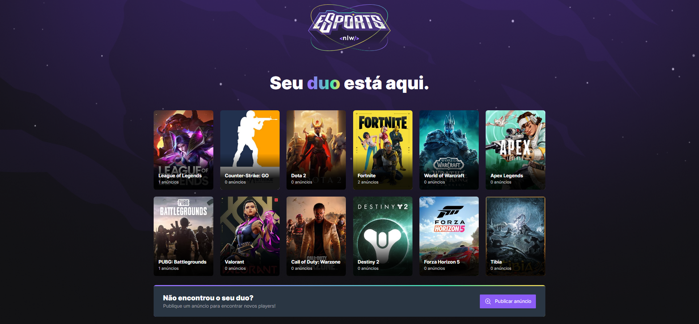
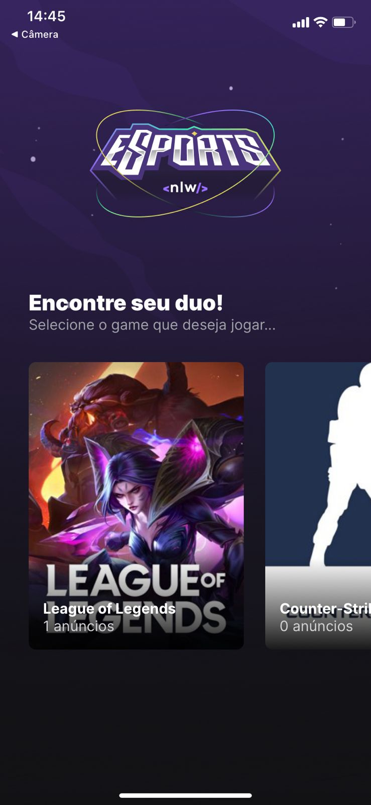
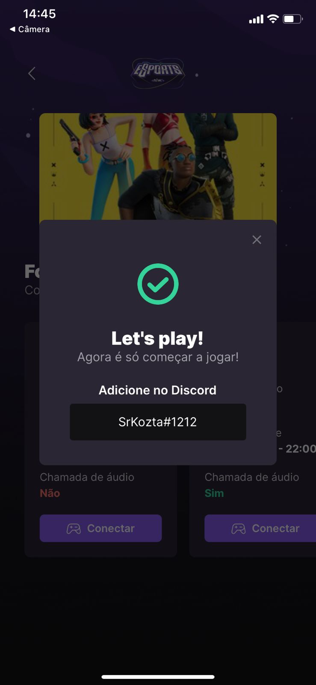
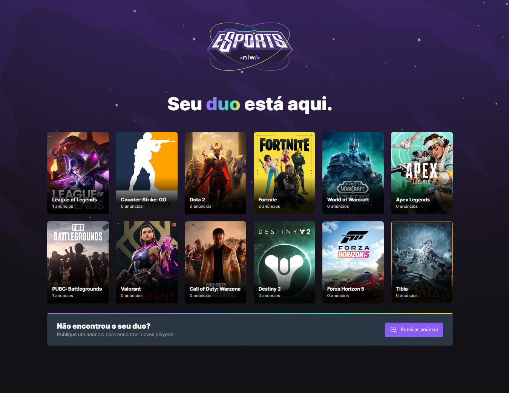
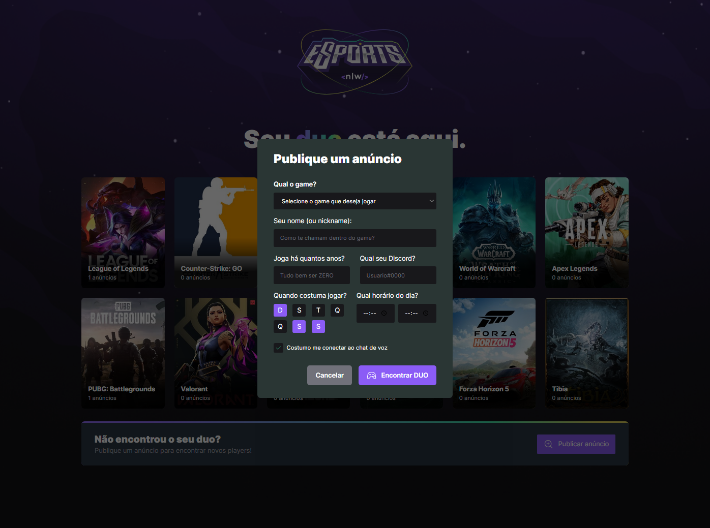

  

  
  
  
    
   
   

<h1 align="center">
    
</h1>

<h4 align="center"> 
	🚧 FindYourDUO ♻️ In-Progress 🚀 🚧
</h4>

 <a href="#-sobre-o-projeto">Sobre</a> •
 <a href="#-funcionalidades">Funcionalidades</a> •
 <a href="#-layout">Layout</a> • 
 <a href="#-como-executar-o-projeto">Como executar</a> • 
 <a href="#-tecnologias">Tecnologias</a> • 
 <a href="#-contribuidores">Contribuidores</a> • 
 <a href="#-autor">Autor</a> • 
 <a href="#user-content--licença">Licença</a>

## 💻 Sobre o projeto

🎮 FindYourDuo - é uma plataforma na qual jogadores podem buscar outros jogadores para formarem times e jogarem seus jogos preferidos juntos! 

Projeto desenvolvido durante a **NLW - Next Level Week** oferecida pela [Rocketseat](https://blog.rocketseat.com.br/primeira-next-level-week/).
O NLW é uma experiência online com muito conteúdo prático, desafios e hacks onde o conteúdo fica disponível durante uma semana.

---

## ⚙️ Funcionalidades

- [x] Usuários podem criar anúncios na versão Web
- [ ] Login/Signin social utilizando Discord
- [ ] Vincular plataformas de jogos
    - [ ] Sincronizar progresso de jogos
    - [ ] Sincronizar bibliotecas de jogos

- [x] Os usuários tem acesso ao aplicativo móvel, onde podem:
  - [x] Listar todos os anúncios criados
  - [x] Se conectar com os anúnciantes através do ID do discord
  - [ ] Receber uma notificação quando alguém se conectar a um anúncio
  - [ ] Criar um anúncio

---

O layout da aplicação está disponível no Figma:

### Mobile

  

  

  

### Web

  

  

---