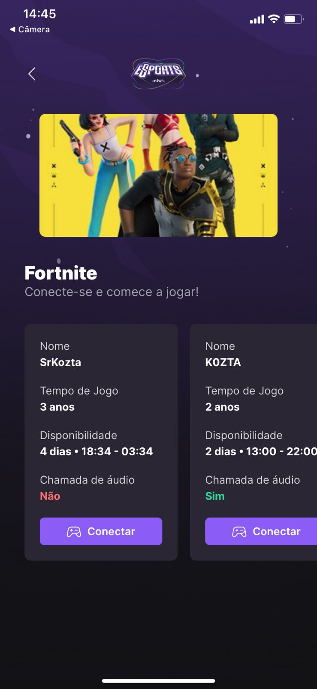

<p align="center">
  

  
  
  <a href="https://github.com/ricassiocosta/FindYourDUO-NLW/commits/master">
    
  </a>
    
   
   <a href="https://github.com/ricassiocosta/FindYourDUO-NLW/stargazers">
    
  </a>
</p>

</p>
<h1 align="center">
    
</h1>

<h4 align="center"> 
	🚧 FindYourDUO ♻️ In-Progress 🚀 🚧
</h4>

<p align="center">
 <a href="#-sobre-o-projeto">Sobre</a> •
 <a href="#-funcionalidades">Funcionalidades</a> •
 <a href="#-layout">Layout</a> • 
 <a href="#-como-executar-o-projeto">Como executar</a>
</p>

## 💻 Sobre o projeto

🎮 FindYourDuo - é uma plataforma na qual jogadores podem buscar outros jogadores para formarem times e jogarem seus jogos preferidos juntos! 


Projeto desenvolvido durante a **NLW - Next Level Week** oferecida pela [Rocketseat](https://blog.rocketseat.com.br/primeira-next-level-week/).
O NLW é uma experiência online com muito conteúdo prático, desafios e hacks onde o conteúdo fica disponível durante uma semana.

---

## ⚙️ Funcionalidades

- [x] Usuários podem criar anúncios na versão Web
- [ ] Login/Signin social utilizando Discord
- [ ] Vincular plataformas de jogos
    - [ ] Sincronizar progresso de jogos
    - [ ] Sincronizar bibliotecas de jogos

- [x] Os usuários tem acesso ao aplicativo móvel, onde podem:
  - [x] Listar todos os anúncios criados
  - [x] Se conectar com os anúnciantes através do ID do discord
  - [ ] Receber uma notificação quando alguém se conectar a um anúncio
  - [ ] Criar um anúncio

---

O layout da aplicação está disponível no Figma:

<a href="https://www.figma.com/file/h7M8qi20eL3MQMsTV3WEkl/NLW-eSports-(Community)?node-id=0%3A1">
  
</a>


### Mobile

<p align="center">
  

  

  
</p>

### Web

<p align="center" style="display: flex; align-items: flex-start; justify-content: center;">
  

  
</p>

---

## 🚀 Como executar o projeto

Este projeto é divido em três partes:
1. Backend (pasta server) 
2. Frontend (pasta web)
3. Mobile (pasta mobile)

💡Tanto o Frontend quanto o Mobile precisam que o Backend esteja sendo executado para funcionar.

### Pré-requisitos

Antes de começar, você vai precisar ter instalado em sua máquina as seguintes ferramentas:
[Git](https://git-scm.com), [Node.js](https://nodejs.org/en/). 
Além disto é bom ter um editor para trabalhar com o código como [VSCode](https://code.visualstudio.com/)

#### 🎲 Rodando o Backend (servidor)

```bash

# Clone este repositório
$ git clone git@github.com:ricassiocosta/FindYourDUO-NLW.git

# Acesse a pasta do projeto no seu terminal/cmd
$ cd FindYourDUO-NLW

# Vá para a pasta server
$ cd server

# Instale as dependências
$ npm install

# Execute a aplicação em modo de desenvolvimento
$ npm run dev

# O servidor inciará na porta:3333 - acesse http://localhost:3333 

```

#### 🧭 Rodando a aplicação web (Frontend)

```bash

# Clone este repositório
$ git clone git@github.com:ricassiocosta/FindYourDUO-NLW.git

# Acesse a pasta do projeto no seu terminal/cmd
$ cd FindYourDUO-NLW

# Vá para a pasta da aplicação Front End
$ cd web

# Instale as dependências
$ npm install

# Execute a aplicação em modo de desenvolvimento
$ npm run dev

# A aplicação será aberta no navegador

```
